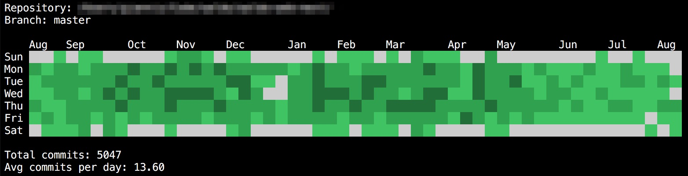

# git-contrib-calendar



This is an experimental git contributions calendar running on the terminal for any local repository.

The interface is inspired by the famous GitHub profile contributions graph, where each block represents a single day, and the color shade depends on the number of commits for that particular day.

## Features

-   Node 12.x
-   Ink 3.x
-   React 16.x
-   ESLint 7.x
-   Prettier setup
-   Commander CLI

## Install

```
npm i
```

## Run for any local repository

```
npm start -- -p <target repo path>
```

## Run for any local repository and filter by author

```
npm start -- -p <target repo path> -a <author>
```
