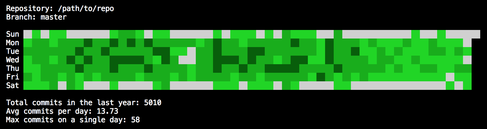

# git-contrib-calendar



This is an experimental git contributions calendar running on the terminal for any local repository.

The interface is inspired by the famous GitHub profile contributions graph, where each block represents a single day, and the color shade depends on the number of commits for that particular day.

## Features

-   Node 12.x
-   Ink 3.x
-   React 16.x
-   ESLint 7.x
-   Prettier setup
-   Commander CLI

## Install

```
npm i -g git-contrib-calendar
```

## Run for git repository on the current path

```
git-contrib-calendar
```

## CLI options

```
-p, --path     Path to any local git repository (example: -p /path/to/repo)
-a, --author   Filter git commits by author (example: -a John)
-v, --version  Display the app version
-h, --help     Display help
```
